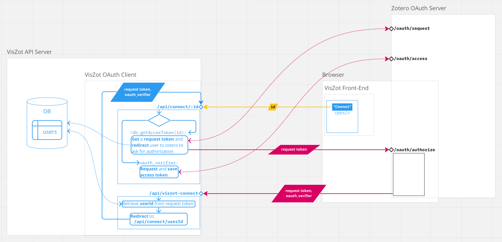

# VisZot: Visualize your Zotero collections

## 1 Introduction

### 1.1 Motivation

Citation management software is valuable to researchers, allowing them to import citations<!--from various sources such as library catalogs, databases, and web pages-->, group them together, annotate them and create bibliographies in various styles. While such features are useful in organizing <!--(synonym: cataloging)--> literature, they fall short of evolving <!--(synonym: enhancing)--> the researcher's understanding of a domain. <!--(keywords: "the-use-of-mapping-in-literature-review", "knowledge synthesis", "mapping review")--> Drawing relationships between citations in one's catalog, like paper A "extends"/"contradicts" paper B, can help identify overlaps and gaps in the literature, and highlight areas where more research is needed.

### 1.2 Contribution

In this project I develop a web application, VisZot, that extends the citation management software Zotero. Zotero is a free, open-source application that lets users organize sources (e.g. books, articles, web pages) into "collections", which are exportable and shareable. Notably, it makes is exceptionally easy to capture bibliographic information from the web (e.g. with the "Zotero Connector" web browser extension). My application, VisZot, allows users to define and visualize relationships between citations in their Zotero library (e.g. A cites B). All data created in VisZot gets stored with the citations in Zotero using the Zotero API. Therefore, a user's VisZot data and Zotero library are fundamentally synchronized and Zotero's features are still fully usable.

### 1.3 Overview

In this document I provide a description of the development enviroment, an explanation of the application's architecture, a discussion of features and limitations and an outline of future improvements.

## 2 The Development Environment

This is a full-stack web development project, meaning it requires the development of both front-end and back-end components of a web application: the user interface (UI), the server-side logic, and a database.

### 2.1 Selected Tools

Firstly, my selected programming language for the logic in both the front-end and back-end components is JavaScript and both components are built for the Node.js runtime environment. Furthermore, here is a list of tools I use in developing the three parts of the application:

- **User interface:** React — a popular application framework that allows the developer to create reusable UI components and manages their state efficiently, making it easy to build complex, interactive applications.
- **Server:**  Express — a minimal web application framework for building RESTful APIs (stateless, separate from client, etc.) for Node.js, whose flexibility makes it ideal for a wide range of projects, including single-page applications.
- **Database:** Sqlite — a widely used library that provides a relational database management system (RDBMS) with a file-based database that can be used without a separate server process, offerring efficiency, reliability, and portability.

### 2.2 Containerization

To help manage the different application components during development, as well in preparation for deployment, I use the containerization platform Docker. Containerization is the process of packaging an application's code with all its dependencies (files, libraries, etc.) in an isolated software environment (container) so that it runs on any infrastructure. My top-level container, "viszot", contains three services ("sub-containers"): "vz-server", "ngrok" and "vz-front". Naturally, "vz-server" includes the server code and the database file, while "vz-front" includes the user interface code.

### 2.3 HTTP Tunneling

The service "ngrok" runs an instance of the application ngrok. Ngrok is a tool that allows the developer to expose a web server running on their local machine to the Internet via a secure tunnel. By exposing the port that the VisZot server listens on, we allow the Zotero OAuth server to redirect to VisZot, after the user gives us authorization to interact with their Zotero library on their behalf (see section 3 for more details). <!--For the full, containerized application to function properly, all three services must be running.-->

## 3 Application Architecture

### 3.1 VisZot server: a client (!) for Zotero OAuth

As mentioned, VisZot reads and writes from/to the user's Zotero collections. To interact with the Zotero API on behalf of the user, we need an API key that grants us the appropriate permissions. We can acquire an API key through an OAuth exchange with the Zotero server.

**OAuth** — is a protocol that allows secure authorization, i.e. a user granting access to their resources stored on one site (e.g. collections of citations in Zotero) to another site (e.g. VisZot) without sharing their credentials, such as username and password. In OAuth, there are three parties involved: the user, the resource owner (e.g. Zotero; who owns the resource that the user wants to access), and the client (e.g. VisZot; the third-party application that wants to access the resource on behalf of the user). The user authorizes the client to access the resource, and the client obtains an access token from the authorization server. The access token is then used to access the resource on behalf of the user.



Below are the steps of the OAuth flow between VisZot and Zotero:

1. Starting in the front-end on the screen to link your Zotero account, the user submits a request to the endpoint "/api/connect/:id" on the VisZot server.
2. Assuming that this is the user’s first-time use, there is no API key (access token) associated with them in the database yet. Therefore, we initiate the process of acquiring a new access token.
   We make a request to the endpoint “/oauth/request” on the Zotero API server and we receive back a "request" token: an object with two values, "oauth_token" and "oauth_token_secret". Note: from here on, we may refer to this "oauth_token" as the request token, and to "oauth_token_secret" as the request token secret.
3. On the VisZot server, upon receiving the response from "/oauth/request", we save the request token in the field "requestToken" for the user. Also, we encrypt the request token secret and store the encrypted value in "reqTokenSecret".
4. Having gotten a request token, we redirect the user to Zotero (specifically, the "/oauth/authorize" endpoint) to log in with their Zotero credentials and approve our authorization request. Note: the request token is sent along in the redirect.
5. When we registered our app with Zotero, we listed a callback URL. This is the URL to which Zotero forwards data after the user grants us authorization. The forwarded data includes the request token, plus a new key, "oauth_verifier". We receive these in our endpoint: "/api/viszot-connect". Upon receiving a request, this endpoint retrieves the user's id from the database by querying by the request token.
6. Having recovered the user id, we forward the request token and the oauth_verifier to the "/api/connect/:id" endpoint.
7. Since this request provides an "oauth_verifier", we handle it differently: we request an access token from the Zotero OAuth Server, providing the request token, the request token secret and the oauth_verifier.
8. We receive back an object with an access token & access token secret, the user’s Zotero user id and the user's Zotero username. We encrypt this information and store it in the database in the accessToken field for the user. The access token secret is the Zotero Web API key. We use it to interact with the Zotero API on behalf of the user.

<!-- 

## Installation
There are two components to VisZot: (1) a plugin (/"addon") for the Zotero standalone app, and (2) an extension for the Google Chrome browser. Below you will find instructions on how to install each.

### 1) Installing the Zotero standalone plugin
You may install the Zotero standalone plugin either manually or programatically (automatically).

**Manual installation**
In Zotero, go to "Tools -> Add-ons -> Tools for all Add-ons (the small, drop-down wheel in the top right corner) -> Install Add-on From File" and select the file viszot.xpi located in the directory viszot-zotero-plugin. Restart Zotero when prompted.

**Auto installation (useful in development)**
1. In the terminal, `cd` to the directory `viszot-zotero-plugin`.
2. Run `python install.py` (you might need to install required packages by running `pip install -r requirements.txt` inside `viszot-zotero-plugin/viszotdev_py_helpers` first).

**How to make addon installation file (xpi) from current source code**

(On Mac) Inside the directory `zotero-plugin`, run

```./scripts/darwin/xpify.sh src```

This will create the file `VisZot-XXXX.xpi` in the directory `zotero-plugin`, where "XXXX" is the current version. It will overwrite any previous xpi files in the directory. The newly created xpi file can be used to install the addon (plugin) to Zotero.

**How to increment addon version programmatically**

(On Mac) Inside the directory `zotero-plugin`, run

```./scripts/darwin/version++.sh src```

This will increment the version inside `src/install.rdf` if there are uncommitted changes anywhere under `src/chrome`.

**Adding pre-commit hook (optional)**

You may automatically update the Zotero plugin version before committing changes to its source code by adding the following git pre-commit hook:

```
#!/bin/bash

./zotero-plugin/scripts/darwin/version++.sh zotero-plugin/src
./zotero-plugin/scripts/darwin/xpify.sh zotero-plugin/src
```

### 2) Installing the Google Chrome Extension
In the Extensions managment view ("chrome://extensions/"), click "Load Unpacked" and select the "viszot-chrome-extension" directory when prompted.

## System Requirements
- Zotero 5.* Standalone
- Google Chrome 92.* browser
- (For auto-installing the Zotero plugin) Python 3
-->